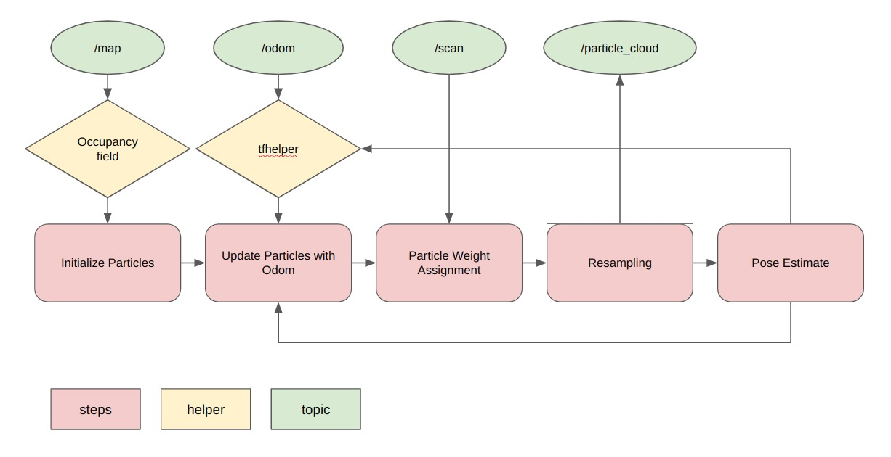
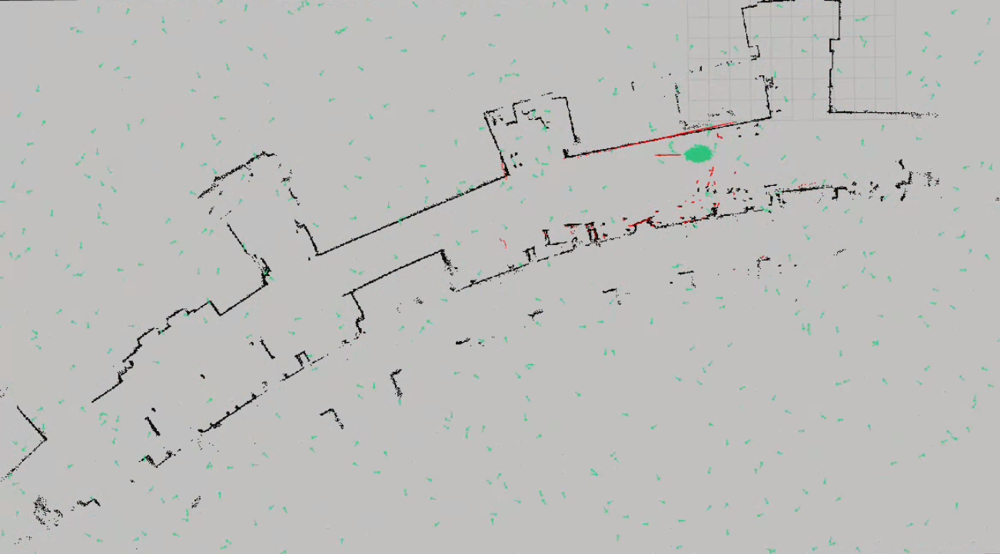

# Robot Localization Project

Oscar Bao, Bill Le  
Fall 2025

## Project Goal

The goal of this project is to determine the robot’s pose in the world frame (localization) using a particle filter with information from the robot’s LiDAR sensor and odometry. We are given the map, populated with information about obstacles and walls, and a ROS2 `bag` file that contains the information of a robot traveling down somewhere on the map. The particle filter generates and resamples particles within the bounds of the map based on its confidence of where the robot could be. Then, it compares the LiDAR sensor data that is plotted onto each particle and compares it with the real map. 

A skeleton code is provided by the teaching team with supporting helper functions. From there, the steps we implemented are particle initialization, particle update with regards to odometry, particle weight assignment, particle resampling, and pose estimation. We test the performance of the filter on RVIZ where it shows a reasonable amount of accuracy and consistency. Within the implementation, we made a few design decisions outside of the given basic filter. More details will be provided in later sections.

<p align="center">

 <br>
Fig.1 Recordings of local algorithm working
</p>

The gif on the top shows our particle cloud closely following the robot after succesfully converging, and the gif on the bottom shows how the localization algorithm can recover from wrong convergences because we reserved a portion of particles that are always uniformly distributed.

The full screen recordings of two runthroughs can be found [here](https://olincollege-my.sharepoint.com/:f:/g/personal/xbao_olin_edu/EnM85PzJkjZNhfwgBXLRSNsB_8hwo-6voIztSSql0D6m4w?e=Ueln1t).

## Methodology

The particle filter has four main steps: initialization, update with odometry, weight assignment, and resampling. Throughout the steps, the particles are normalized to ensure consistency. At the end of a cycle, we will use the particles and their weights to determine the pose estimate of the robot in the world frame. 

The two topics subscribed to are `/scan` and `/odom`. The scan topic provides the LiDAR data used in the weight assignment step. The odom topic provides information on the robot’s movement which is used in the update with odometry step.

<p align="center">
 <br>
Fig.2 System diagram
</p>

### Particle Initialization

The first step of the filter is initializing the particles within the map bounds. We get the map bounds from the `occupancy_field` object (occupancy_field.py) provided by the teaching team. The particles are then generated within the bounding boxes of the map through a uniform distribution, meaning that every location in the bounded area has an equal chance of occurring. Each particle is assigned an equal weight where the sum of all the weights of every particle adds up to one. The generated particles are added to the particle cloud list to be used in the later steps. 

```python
particle = Particle(
  x=np.random.uniform(low=self.bbox[0][0], high=self.bbox[0][1]),
  y=np.random.uniform(low=self.bbox[1][0], high=self.bbox[1][1]),
  theta=np.random.uniform(low=-np.pi, high=np.pi),
  w=1 / self.n_particles)
```

### Particle Weight Normalization

The weight normalization method we chose was that all particle weights must add up to one. During the resampling step, we resample the particles based on probabilities (the confidence we have on each particle), where each particle represents a guess of where the robot could be. Hence, the weights adding up to one is consistent with this resampling method, as a probability of one represents all the possible choices,

```math
w_{i,t+1} = \frac{w_{i,t}}{\sum^{n_p}_{k=0} w_{k,t}}
```

where $n_p$ is the number of particles.

### Particle update with odometry

The skeleton code provided us with the changes in the robot pose based on the base frame, which is called `delta`. The changes, `delta`, are already provided within the world frame, simplifying the task for us greatly. We add the changes in `x` to each particle, and do the same with `y` and `theta`.

```python
particle.x = particle.x + delta[0]
particle.y = particle.y + delta[1]
particle.theta = particle.theta + delta[2]
```

However, we have to ensure that our representation of angles is consistent. We decide that the best representation of angle is to represent the values in the ranges of (-1.57, 1.57) in radians. The helper code provides an angle normalization function to perform this task.

### Particle Weight Assignment

We assigned weight based on the LiDAR readings from the Turtle Bot. For each LiDAR reading passed in, we translate it from the original polar coordinates to Cartesian coordinates, and offset it by each particle’s position and heading. Namely, for each scan with distance $r$ and heading $\theta$, we calculate its position in relation to each particle by 

```math
\begin{align*}
x &= r \times \cos(\theta) + \text{particle.x} \\
y &= r \times \sin(\theta) + \text{particle.y}
\end{align*}
```  
<br>
Doing so, we get a list of `map` frame coordinates that represent where the scan is in the `map` frame, if the robot were at the particular particle’s position. We then utilize the provided `get_closest_obstacle_distance()` function, which takes in coordinates from the `map` frame and returns a scalar number representing the distance from that point to the closest obstacle. 

In an ideal world, if the particle’s position is 100% correct, the distance returned for every scan, or `error`, should be 0. Therefore, after we pass in each particle scan’s coordinate and get an `error`, we can calculate the penalty to its weight given how far off it is. We utilized a Gaussian function to determine the penalty, specifically

```math
p = -\frac{error^2}{2\sigma ^2},
```
<br>
where $p$ is the penalty, and $\sigma$ is the sensitivity constant, with a lower $\sigma$ being more forigiving, and vice versa. 

Finally, to calculate the weight of each particle, we sum up the penalty and apply it to an exponential function, 

```math
w = \exp\left(\frac{\sum{p}}{n}\right),
```

where $n$ is the number of valid scans. 

With each particle's weight calculated, we normalize them and ship it off to resampling. 

### Particle Resampling

The resampling comprises three smaller steps: discrete resampling, generating random uniform particles, and adding noise. The discrete resampling aims to converge the points into poses that have higher weights (confidence). However, we are also aware that there is a possibility of convergence at a local minimum. The random uniform particles tackle this problem by always leaving an option for the filter to escape the minimum. Finally, adding noise ensures that there are new particles being introduced around the area of convergence.

Discrete resampling generates particles based on a provided list of particles and their weights, which acts as probabilities. If one particle has much higher weights than the rest, we know more of the exact copy of that particle will be generated. If the weights are low, the particle will appear less often or not appear at all. With this, copies of particles that are more confident will be generated at a higher rate, leading to convergence at the likely pose.

```python
self.particle_cloud = draw_random_sample(self.particle_cloud, self.weight_list, len(self.particle_cloud))
```

If multiple locations on the map have the same features, there is a high chance of convergence at a local minimum. We counteract this by always generating random particles in a uniform distribution around the map. Our filter works best when the ratio is 20% of particles generated randomly. In a situation where the filter has converged at a local minimum, the randomly generated particles could be at a more likely position, giving it a higher weight. In the next iteration, more particles will now be generated at that location, breaking us out of the local minimum.

<p align="center">
 <br>
Fig.3 Particles in green showing that 20% of them are uniformly distributed at all time

</p>

Using only discrete resampling, the filter is stuck with the same points that were generated at the initialization step. It is very likely those particles are not the most optimal pose locations. Therefore, by adding noise, we introduce new particles which could have higher confidences than existing particles. The method to add noise is by generating points based on a normal distribution around the mean zero. The standard deviation is calculated based on the existing particle clouds. The standard deviation of the particle cloud generally introduces too much noise. Therefore, we divided the standard deviation by a constant to ensure more consistency in our filter. This approach allows us to generate more noise when particle clouds are not confident, and slowly decrease the amount of noise as the particle filter becomes more confident.

```math
\begin{align*}
s_x = \sqrt{\frac{\sum_{i=0}^{n_p} x_i - \bar{x}}{n_p - 1}} \\
s_y = \sqrt{\frac{\sum_{i=0}^{n_p} y_i - \bar{y}}{n_p - 1}}
\end{align*}
```

For normal distribution generation:

```math
\begin{align*}
std = \frac{s_x}{15} \\
std = \frac{s_y}{15}
\end{align*}
```


### Pose Estimation

After we have an updated particle cloud, we calculate the robot's pose by doing a weighted sum of the robot's `x` and `y` position, and averaging the headings of the top 100 particles by weight. The reason for a special treatment for heading is that it's harder to sum angles by weight, so we decided to approximate that by simply averaging the top 100 particles. Therefore, for robot pose $Pose_x$, $Pose_y$, and $Pose_\theta$,

```math
\begin{align*}
Pose_x = \sum_{i=0}^{n}{w_i x_i} \qquad  Pose_y = \sum_{i=0}^{n}{w_i y_i}
\end{align*}
```
```math
Pose_\theta = \text{atan2}(\sum_{i=0}^{100}{\sin(\theta_i)}, \sum_{i=0}^{100}{\cos(\theta_i)}),
```

where $n$ is the number of particles.

## Noticeable Design Decisions

Initially, we had problems with the filter converging at a local minimum. And since all particles are fairly confident, they slowly collapsed into one point and the filter was stuck. To tackle this, we introduced random particles that are generated using a uniform distribution, meaning that random particles will be generated every cycle with an equal chance at every location in the map. This ensures that, when our filter converges at a local minimum, there will always be a chance we can get out if a randomly generated particle is at a more likely pose. We tested the filter with differing ratios and qualitatively decided that the ratio 10% allows for the best performance, with just enough random particles to escape local minimums consistently without trading off the confidence that we have in our current filter’s most confident pose. We also had a problem with our particles collapsing onto exactly one pose. Our solution to this was to add noise, generating new points so that our filter does not get stuck with only one guess. The reason we chose the normal distribution was because it gave us an algorithmic way to change how much noise we are adding as the particles converge.

## Conclusion

### Challenges

The main challenge we faced in this project was figuring out which part of the code was working incorrectly. Because we developed our code implementation of assigned steps separately and did not test them until full integration, debugging became extremely difficult. When the system failed to behave as expected, it was unclear which specific section was responsible for the issue. This lack of early testing meant that errors from different components interacted in complex ways, making it hard to isolate the root cause. As a result, we spent significant time tracing the flow of data and outputs between topics, often testing hypotheses blindly. For instance, we encountered problems in the implementation of particle updates with odometry but could not identify the source of the inaccuracy because hundreds of particles made the results difficult to interpret. Eventually, we simplified the test case by using only one particle, which helped reveal the incorrect behavior.

### Improvement and Future Works

In the initialization/resampling steps, we can generate particles only within the map. The bounding box is approximately two to three times bigger than the actual map itself. Lots of particles are generated in spaces that are impractical and provide no value to the filter. Better particles means better guesses and could reduce the amount of time it takes to converge. This could also lower the amount of particles we need to generate, decreasing computational load.

Currently, pose estimation is based on the mean of all `x`, `y`, and `theta` values. This is fine when there is only one area of convergence but is impractical when there are multiple, as it will return a pose between the two areas of convergence. Instead, in our future implementation, we will use the modal class to classify points into grids on the map, and find the average of the points in that grid. This implementation can be done through the 2D histogram class from numpy. Furthermore, we can then return multiple possible poses with confidence attached to them. At the start of the run, the robot does not know whether it is on the left or right side of the MAC third floor, and providing this information with multiple possible poses is more transparent and accurate.

If given more time, we would also like to apply our particle filter on the physical Neato. It’ll be interesting having to account for the unpredictability of changing furniture, error in encoder readings, and many other problems that can occur.

### Lessons for Future Projects

In this project, we wrote our code separately and didn’t bother testing our code until we integrated every part together. This led to the challenges mentioned above, of not knowing which steps of the implementation were incorrect. Next time, we will test code early and often before each implementation becomes too intertwined in the system, especially when there are multiple incorrect sections. Incremental testing after each development milestone will save time during debugging but also improve our confidence in the progress we’ve made.

In the same vein, we must create clear evaluation criteria and structured testing exercises to provide measurable standards for progress. For example, we had trouble identifying a problem, incorrect implementation of updating particles with odometry, because it was hard to spot the error with 300 particles to look at. Eventually, we figured that we can create one particle and see what it actually does, which finally gave us a clue that there was a problem. Well-defined tests ensure that each subsystem meets its intended purpose. So when a problem arises, we can narrow down critical areas to debug.

Third, we learned the importance of challenging our assumptions. An incorrect implementation in one step can easily mask or misrepresent issues in another, leading to misdiagnosis of problems. Regularly testing and verifying assumptions can help prevent cascading misunderstandings.

Finally, collaboration and discussion with other groups were invaluable. Sharing ideas and comparing implementation strategies often revealed conceptual errors or alternative solutions that might not have been apparent within our own team. This exchange of perspectives strengthened both our technical approach and our overall understanding of the system.


